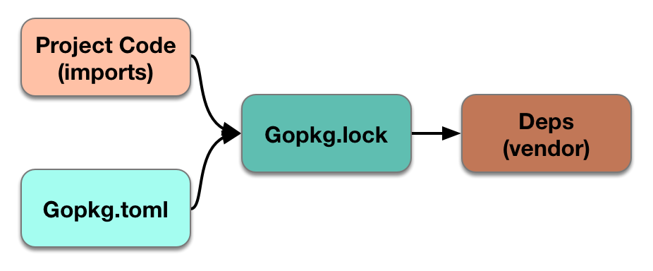

# vendor
用于支持本地包管理依赖，通过 vendor.json 文件记录依赖包版本，可以将项目依赖的外部包拷贝到项目下的 vendor 目录下。
### 命令
govendor init

govendor add +external

govendor list

govendor list -v fmt

govendor fetch golang.org/x/net/context@{version-id}

govendor fetch golang.org/x/net/context@v1

govendor fetch golang.org/x/net/context@=v1

govendor fetch golang.org/x/net/context

govendor fmt +local

govendor install +local

govendor test +local
  
# dep

### 命令
dep init

dep ensure

dep ensure -add 

dep check

dep status 

# 内建函数
> close()
用于关闭 channel（双向或者只写的），将不在阻塞读取。如果 channel 关闭且没有值，读取 ok 将会为 false
> select case
1. 存在 default 不阻塞
2. 不存在 default 阻塞

# 垃圾回收
+ STW (Stop the World)
+ Mark STW，SWEEP 并行
+ 三色标记法
+ 写屏障( write barrier)

> 三色标记法
1. 所有对象最开始是白色
2. 从 root 开始找到所有可达对象，标记为灰色，放入待处理队列
3. 遍历灰色对象队列，将其引用对象标记为灰色放入待处理队列，自身标记为黑色
4. 处理完灰色对象队列，执行清扫工作

# struct tag
可以很方便的进行 json 、yaml 等文件的解析

# ref
1. <a href="http://legendtkl.com/2017/04/28/golang-gc/">Golang 垃圾回收剖析</a>
2. <a href="https://www.jianshu.com/p/c4ec92afeca8">golang 自定义 struct 字段标签</a>

